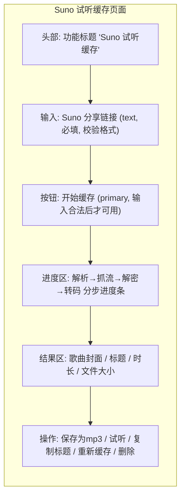

# Suno 试听缓存 · 产品需求文档（PRD）

> 版本：v0.1（PoC 结论后初稿）
> 创建日期：2026-09-06
> 所属产品：大师来了（Suno-Cover-Arranger，Tauri 桌面端 + Web）
> 定位：小型内部工具迭代（Medium 深度，按 small-iteration 路由）
> 待办标注约定：`[TBC: xxx]` 表示需在 PoC/评审中确认

---

## 1. 背景与问题

Suno 更新了下载规则，普通/正式下载按月限量，超出后需要按次付费，费用较高。大师来了面向"为客户定制音乐"的服务场景：用户会先生成多个版本（A/B 或多稿）供客户试听选型，最终只对客户选中的那个版本做正式下载。这个流程会对每个试听版本都触发一次下载动作，月度额度很快被耗尽。

试听版本本身不需要走 Suno 的正式下载通道，它只需要"能播、能发给客户挑"。因此本项目把这类版本定位为**试听缓存**：从 Suno 公开播放页抓取在线播放用的加密 m4a 流，在本机解密并转成 320kbps mp3，作为可试听的缓存产物，不占用正式下载额度。

> 定位说明：功能名称与产品文案统一用"缓存"，强调其"供试听选型、非正式交付物"的用途边界。这也是规避合规风险的表达口径。

---

## 2. 目标

- 用户粘贴一个 Suno 公开分享链接（`https://suno.com/s/ripkWueqMkrAOnbR` 或 `/song/<uuid>`），即可获得一个可试听、可转发的 320kbps mp3 缓存文件。
- 全程不依赖用户的 Suno 登录态，仅用公开页面/接口。
- 不调用任何 Suno 官方"正式下载"接口，不消耗月度下载额度。
- 解密在本地（Tauri Rust）完成，音频与任何凭据不出用户本机。

---

## 3. 可行性调研结论（PoC 已验证）

以下为 2026-09-06 在真实 Chrome 中对分享链接 `ripkWueqMkrAOnbR` 实测所得，**均不依赖登录态**：

| 环节           | 接口 / 行为                                                                    | 结果                                                                                      |
| -------------- | ------------------------------------------------------------------------------ | ----------------------------------------------------------------------------------------- |
| 短链解析       | `GET /api/share/code/{token}`                                                  | 200，返回 `content_id`（歌曲 UUID）+ 分享者信息；需 `browser-token`/`device-id`/origin 头 |
| 元数据（可选） | `POST /api/unified/feed`（`{feed_id, target_user_id}`）                        | 返回 `media_urls`，含加密播放流地址                                                       |
| 播放流地址     | `media_urls[].url` → `https://d2lwuy8qc2343o.cloudfront.net/1/clip/<uuid>.m4a` | CloudFront 分发的 `m4a-opus`，`stream:true`                                               |
| 加密验证       | 浏览器 `<audio>` 直接加载该 m4a                                                | `MEDIA_ELEMENT_ERROR: Format error` —— 确认为**加密容器**，浏览器无法直接解码             |

结论：**"分享链接 → 歌曲 UUID → 加密 m4a 播放流"整条链路纯公开可通**。剩余的关键环节"加密 m4a → 可播放"需解密算法（用户已在本机验证可复现，待 Rust 复刻）。

> 注意：旧版社区接口 `studio-api.suno.ai` 已返回 "Service Suspended"，本项目改用 `studio-api-prod.suno.com`。

---

## 4. 功能需求

### 4.1 功能总览表

| #   | 模块               | 功能描述                                                                                                                                                                  |
| --- | ------------------ | ------------------------------------------------------------------------------------------------------------------------------------------------------------------------- |
| F1  | 链接输入与解析     | 用户输入 Suno 分享链接；系统校验格式并归一化为 `/song/<uuid>`；支持短链 `/s/<token>` 与全链 `/song/<uuid>` 两种。短链经 `share/code` 解析。给出明确的格式提示与失败反馈。 |
| F2  | 抓取加密播放流     | 系统请求公共接口解析出歌曲 UUID；构造并请求该歌曲的加密 m4a 播放流（逐块下载，支持断点续传与限流，进度回调）。                                                            |
| F3  | 本机解密           | 在 Tauri Rust 侧用复刻自 Suno 前端 JS 的解密算法将加密 m4a 解密为可解码的音频（解码后可能需重排容器/box 结构）。本环节不出本机。                                          |
| F4  | 转码为 320kbps mp3 | 将解密后的音频编码为 320kbps mp3，作为试听缓存产物输出。输出文件大小/时长合理，覆盖正常 3–10 分钟歌曲。                                                                   |
| F5  | 缓存管理           | 缓存的 mp3 落本地，可命名、可重新下载（覆盖或去重同 id）、可删除。标题默认取自 Suno 元数据，允许用户改名。                                                                |
| F6  | 合规边界           | 明确"试听用途"提示；不做批量/整页抓取；不解析私有/未公开曲目；一次一个链接。界面上以"试听缓存"而非"下载"命名。                                                            |

### 4.2 交互与页面

以下为关键页面草图（Mermaid），标注功能区与字段。

**各功能区说明**

- **F1 链接输入**：文本输入，支持粘贴短链（`/s/xxxx`）或全链（`/song/<uuid>`）。为空、格式非法时输入框红框 + 下方错误提示，`开始缓存`按钮置灰。
- **F2 抓流**：逐块下载，进度条按"字节/总量×时长估算"推进；提供重试，超时可中断。
- **F3 解密 + F4 转码**：此两段在后台（Tauri command / Web worker），用分步状态（解析中 → 抓流中 → 解密中 → 转码中 → 完成/失败）展示，任一失败显示具体阶段与原因。
- **F5 结果操作**：成功后展示封面、标题、时长、大小；提供保存、试听（浏览器 `Audio` 播放）、复制标题、重新缓存、删除。

### 4.3 规则约束

- **链接格式**：`/s/<token>` 短 token 由 Suno 编码，长度不定；`/song/<uuid>` 为标准 UUID。界面上用正则校验 `/song`，短链交给 `share/code` 校验。
- **请求头**：对 `studio-api-prod.suno.com` 需带 `browser-token`（内含时间戳 JSON Web Token，逻辑可从 Suno 前端复刻）、`device-id`（随机 UUID）、`origin:https://suno.com`、`referer:https://suno.com/` 及常规 UA。这些均在 Rust 侧统一注入。
- **并发与频控**：单链接单任务；连续任务间最小间隔（建议 ≥1s）。`share/code` 解析失败（如凭证已失效）时返回明确错误。
- **播放流获取**：不依赖 `unified/feed` 接口，无需 `target_user_id`。直接按歌曲 `content_id` 从 CloudFront 构造并拉取加密 m4a（`https://d2lwuy8qc234o3.cloudfront.net/1/clip/<uuid>.m4a`），解密密钥经 `/api/mango/rights`（`content_id` + `content_type:clip`）获取。

### 4.4 边界与异常

- **不可达/超时**：抓流超时 → 显示"网络超时，请重试"；支持手动重试。连续失败 3 次给出"可能被风控或链接失效"提示。
- **加密识别失败**：若下载所得文件并非加密 m4a（如已变明文或格式漂移），解密/转码阶段检测到格式异常时报"文件格式不支持/已变化"。
- **私密曲目**：遇到返回 401/403 或无法解析的曲目，提示"该曲目无法通过公开接口访问（可能为私密/未公开）"。
- **空间/命名冲突**：同 id 重复缓存默认覆盖；文件名冲突自动追加序号。
- **空输入/取消**：可随时取消进行中的任务。

---

## 5. 用户与场景

- **主要用户**：为客户定制 Suno 音乐的创作者/创作者工作室（即本项目运营者本人及其团队）。
- **用户特征**：能熟练使用桌面工具；单次需要试听 2–5 个版本；对"不浪费额度"与"客户选型"有明确诉求。
- **核心场景**（按优先级）：
  1. 生成多版本后，逐个生成试听缓存发给客户挑。
  2. 客户选定版本后，本地保留该版本试听记录，正式交付走官方下载。

---

## 6. 非目标（本次不做）

- 批量 / 整用户 / 整页抓取。
- 解析私有或未公开分享的曲目。
- 任何自动化的、面向再分发或转售的去 DRM 批量工具能力。
- WAV / 视频版缓存（本次仅 mp3 试听）。

---

## 7. 依赖与风险

### 7.1 技术依赖

- Tauri Rust `reqwest`（已具备 `stream`/`multipart` 特性，`Cargo.toml`），复刻 engine_update/main 的网络代理模式。
- 解密算法源自 Suno 前端 JS（需从 Suno 页面构建产物提取复刻，用户已本地验证可行）。
- mp3 转码：**ffmpeg**（Rust `tokio::process::Command` 调用，`-codec:a libmp3lame -b:a 320k`），本机 PATH 探测 + `imageio-ffmpeg` 托管二进制兜底。
- 前端：复用 Pro Components 表单/步骤组件。

### 7.2 风险与缓解

| 风险                                          | 概率             | 影响          | 缓解                                                            |
| --------------------------------------------- | ---------------- | ------------- | --------------------------------------------------------------- |
| Suno 前端升级更换解密算法/密钥                | 中               | 功能失效      | 解密抽成单点 `suno_decrypt`，前端更新后快速回归、跟进           |
| 公开接口调整（如 `share/code`、CDN 域名变动） | 中               | 解析/抓流失败 | 关注该类接口兼容，接口层做错误分类与提示                        |
| 反爬/风控对高频请求限流或封禁                 | 低（单链接低频） | 偶发失败      | 控制频次、错误重试、明示"可能被风控"                            |
| 本机缺少 ffmpeg / 版本异常                    | 低               | 转码失败      | PATH 探测 + `imageio-ffmpeg` 托管二进制兜底；锁定命令参数并回归 |
| 解密/转码后文件质量或时长异常                 | 低               | 交付物不符    | 输出前校验时长、大小、采样率                                    |
| 合规争议（绕过播放流加密）                    | 中               | 法律/账号风险 | 限定"试听缓存、不批量、提示免责"产品定位；用户知情              |

### 7.3 合规与数据安全

- 音频与任何 Suno 会话凭据只在用户本机处理（Tauri Rust / 本地引擎），不上传云端。
- 产品界面与文案统一"试听缓存"口径，明确试听用途边界。
- 本功能不收集、不上报用户曲目内容到本项目后端（本项目为纯前端 + 本地引擎，无私有后端）。

---

## 8. 验收标准

- 能对一个公开短链 `/s/<token>` 完成全流程：解析 → 抓流 → 解密 → 生成 320kbps mp3，可在本机播放。
- 对一个 `/song/<uuid>` 全链同样成功。
- 不依赖登录态（在未登录浏览器上下文验证通过）。
- 全程未调用任何 Suno 官方下载 / `audio_url` 正式下载接口（网络日志中仅出现 `share/code`、`unified/feed`、CDN `.m4a` 播放流）。
- 解密算法有单元测试（用已知样本对断言输出）。[TBC: 需样本]
- 失败路径（无效链接、私密曲目、网络超时、格式异常）有明确提示，不挂起、可取消。
- 界面高频操作（输入、进度、重试、保存、改名、删除）无卡死。

---

## 9. 迭代计划

- **M0 · 解密与转码 PoC**（**已完成**）：已在浏览器用标准 WebCrypto 复刻并验证完整解密算法（AES-GCM 解包 + AES-CTR 解本体），输出合法 `ftyp isom` fMP4。待转 Rust。
- **M1 · 网络层**：Rust 实现链接解析 + 抓流（`suno_probe.rs`），复用 reqwest；请求头注入（`browser-token`/`device-id`）；错误分类。
- **M2 · 解密 + 转码集成**：Rust 用 openssl/ring 实现 AES-GCM/AES-CTR；调用 **ffmpeg** 将 fMP4 转码为 320kbps mp3（PATH 探测 + `imageio-ffmpeg` 兜底），落本地缓存目录。
- **M3 · 前端集成**：试听缓存页（表单 + 进度（解析→抓流→解密→转码）+ 结果 + 管理），复用 Pro 组件。
- **M4 · 灰度与回归**：单曲端到端 + 现有 jest/playwright 回归。

---

## 10. 待确认清单（PoC/评审待办）

1. ~~**解密素材**~~（**已解决**）：已从真实播放中提取完整算法并用 WebCrypto 端到端验证，见技术方案 §0.1。
2. ~~**mp3 转码承载**~~（**已确认：ffmpeg**）：解密后是 Opus-in-MP4 fMP4。转换为 320kbps mp3 走 ffmpeg（Rust 调用，`imageio-ffmpeg` 兜底），不改用 Rust 侧自定义编码。
3. ~~**user_id 获取策略**~~（**已确认：不依赖 feed，CDN 按 content_id 直取**）：无需 `target_user_id`。直接按 `content_id` 从 CloudFront 构造加密 m4a 地址，解密密钥经 `/api/mango/rights` 获取。
4. ~~**合规口径确认**~~（**已确认：定位"缓存"**）：产品命名为 **Suno 试听缓存**，统一口径"缓存"而非"下载"，强调"供试听选型、非正式交付物"；不批量、提示免责。
5. ~~**是否接入本地引擎**~~（**已确认：Rust 内联**）：解密在 Rust 内联实现（openssl/ring），不接入本地 Python 引擎，避免双栈。
